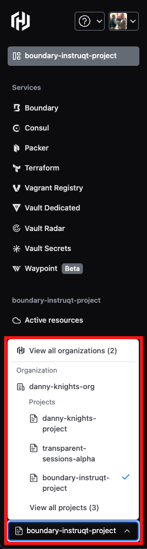
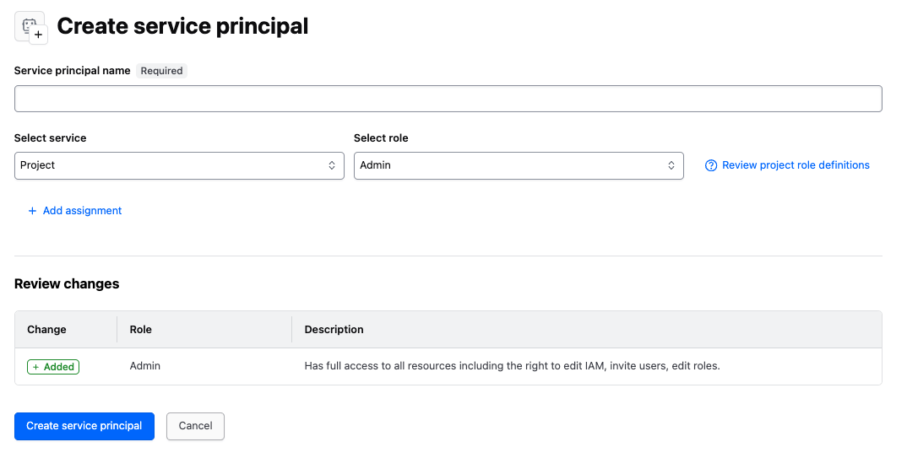
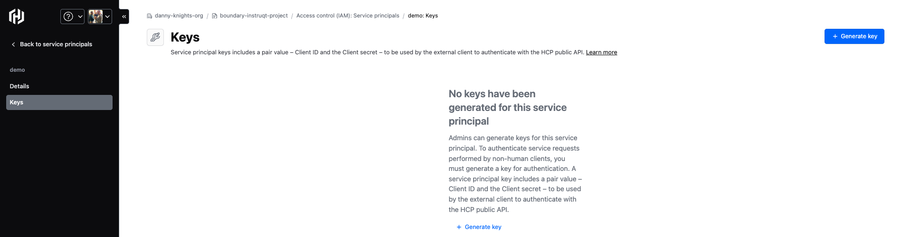

👋 Getting started
===============

The first task is to deploy HCP Boundary and Vault clusters with Terraform.

Click into the HCP tab using your HCP credentials. If you don't have an account, please sign-up. No credit card details are required and you will be credited with $50 to start.

Create a new project in your organisation. If you signed up for an account select the project you just created, as shown in the screenshot below



When you're in your project, click on Access control (IAM) on the left-hand side and then into Service principals and create a new Service principal



Add a Service principal name, leave the 'Select service' as 'Project' and put the 'Select role' to 'Admin' and click 'Create service principal'. When you have done this you will see the ability to click Keys on the left hand side.



Click on '+ Generate key' and you will be shown a Client ID and Client secret. Please note that when you close this box you will not be able to view these details again, so either make a note of them or keep this screen open whilst we deploy Boundary and Vault.

For more information around creating a service principal, please visit this website: https://developer.hashicorp.com/hcp/docs/hcp/admin/iam/service-principals#create-a-service-principal

Now we need to move our credentials into the `terraform.tfvars` file. The variable definitions have already been created for you. Open up the Code Editor tab and navigate to the `hcp-deploy` folder. In that folder will be a `terraform.tfvars` file, there you will see the variable definitions to populate. The files automatically save for you.

When using Terraform at scale, the `terraform.tfvars` file is not a recommended approach, however, for this lab it is convenient to have a central place to reference all the credentials we need to use.

When you have added the credentials into the `terraform.tfvars` file, open the Workstation terminal and move into the `hcp-deploy` directory

In the Workstation terminal, move into the `hcp-deploy` directory

```
cd hcp-deploy
```

Now execute the following commands

```
terraform init
terraform apply
 ```

Type `yes` when prompted.

The deployment will take around 10 minutes. When you see Terraform return `Apply Complete!` in the terminal, hit the green next button in the bottom right hand corner.

🕦 Whilst you're waiting
=====================

Later on in the track we will connect to some targets. We will connect via differing methods, so whilst the clusters are provisioning, please could you download (if you do not have them already) and install the following:

* Boundary Desktop Client - https://developer.hashicorp.com/boundary/tutorials/oss-getting-started/oss-getting-started-desktop-app
* RDP client (if using a Mac) - https://apps.apple.com/us/app/microsoft-remote-desktop/id1295203466?mt=12


