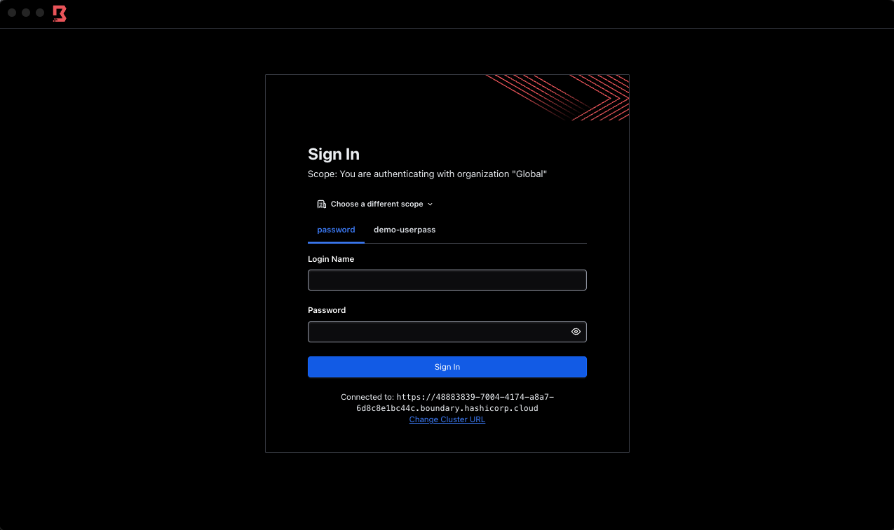

✅ Access to Boundary
===================
To authenticate to Boundary on the CLI, we first need to set the Boundary address as an environment variable:

```bash
export BOUNDARY_ADDR= [[ Instruqt-Var key="boundary_addr" hostname="workstation"]]
```


 Now issue the following command, utilising the username and password below.

```
boundary authenticate
```

```
Boundary Address:[[ Instruqt-Var key="boundary_addr" hostname="workstation" ]]
Boundary Username: admin
Boundary Admin Password: [[ Instruqt-Var key="boundary_password" hostname="workstation" ]]
```

At this point, you can now log into the Admin UI and the Desktop client. In the Admin UI, take a look at what has been created during the logical configuration and to get a feel of the UI.

In the Workstation tab, in the `hcpb-secure-access-instruqt` folder, the `terraform.tfvars` file holds all of the variable/credential definitions you need for this track, as a reference point if you forget what any addresses/usernames/passwords etc. are.

💻 Connecting to targets
=====================

We have three targets deployed which we can connect to. From a connection point of view, we handle the credential aspect differently. The following sub-sections go into more detail around how connectivity is secured for each target type.


🔑 EC2 Amazon Linux VM
====================

When we connect to this target, the SSH credentials are automatically injected into the session, without any user intervention. Boundary generates the Public/Private key pair and sends to Vault to sign. The signed SSH certifcate is passed back to the Boundary Controllers, which then pass it to the worker that is associated with the target. These credentials are ephemeral and are not stored anywhere in the workflow, meaning that risk of credential exfiltration is removed. It is a new key pair for every connection, irrelevant if it's 1 person or 10 people connecting to the same target.

In the Boundary admin UI, if you navigate into the `boundary-demo-org`, `boundary-demo-project` and click `Credential Stores` on the left side, you will see two Credential Stores:

* `boundary-vault-credential-store`
* `boundary-credential-store`

Within the `boundary-vault-credential-store` there are two Credential Libraries

* `boundary-vault-ssh-certs-library`
* `boundary-vault-db-credential-library`

In the `boundary-vault-ssh-certs-library` library, we can see the path in Vault it is aligned to. We can also see the username that will be used for the certificate and the key type, which defaults to ed25519, but can be changed if required. For the username, we are using the default for an Amazon Linux EC2, which is `ec2-user`. However, we do have the ability to create custom certifcates that are for individual users, rather than defaulting to the root/admin username on the device. [This is achieved using Vault credential library parameter templating](https://developer.hashicorp.com/boundary/docs/concepts/domain-model/credential-libraries), but will be outside the scope for this lab.

To connect to this target we have two options to try:

1. For the CLI, first we need to get the Target ID. Switch to the Workstation tab and run the following command:

```
boundary targets list -recursive
```

If you receive an error, ensure you have authenticated via the CLI using the `boundary authenticate` command.

When you have successful ran the `list` command, it will return a list of three targets. We want to get the Target ID for the EC2 target type. The Target ID will look something like `tssh_4Yby023tBa`.

Once you have this Target ID, you can run the following command, inserting your own Target ID instead of the example one below.

```
boundary connect ssh tssh_4Yby023tBa
```

When you connect, you will access the EC2 Linux box as `ec2-user`. Note that you have not had to know what the credentials are, where they are, or had to be promoted from any credentials! However, the connection is secure using the signed SSH certificate. If you go into the AWS Console tab and look at the EC2 that has been deployed, which you have just accessed, you'll notice that there is no dedicated key that has been assigned to securely access this instance. It has all been handled as a just-in-time credential with Boundary and Vault 😎

To exit out of the EC2, simply type `exit`

2. For the Desktop UI, log in, if you haven't done that already, and you will be presented with a list of targets that you can connect to. Find the EC2 Target and click connect. The Desktop UI has a built-in shell, so when you click that shell command you will be automatically connected to the EC2 device, again using the just-in-time signed SSH certificate.


💾 RDS Database
============

When we connect to this target, the credentials are brokered to us, but they are generated by Vault and are ephemeral with a pre-configured TTL. Sign into the Desktop UI and connect to the Postgres database.



Upon successful connection, you will be presented with a view to access the brokered credentials. You can just copy these with the copy button, or make them visible first so you can see them.

From there, please do the following: Open up your own terminal if you have `psql` installed, if not, navigate to the Workstation tab and use the CLI there. Connect to the postgres with the following command, making the following changes:

* Replace the RDS address (`boundary-brokered-demo.cjsk2mcc0q8j.eu-west-2.rds.amazonaws.com`) with the RDS that was deployed. You can issue a `terraform output` command to obtain this.
* Replace the username (`v-token-bo-dba-0FSksmaPG2Yir2UwPMKz-1714404378`) with the username that was brokered by Vault into the Boundary Desktop UI.
* The name of the database (`workshop_postgres`) will still remain the same.

```
psql -h boundary-brokered-demo.cjsk2mcc0q8j.eu-west-2.rds.amazonaws.com -U v-token-bo-dba-0FSksmaPG2Yir2UwPMKz-1714404378 -d workshop_postgres
```

With this workflow, the credentials that have been brokered to us by Vault have a specific policy and TTL attached to it. If you navigate to the Editor tab, and view the `vault-db-config.tf` file within the `hcpb-secure-access-instruqt` folder, you will see that we have a `vault_database_secret_backend_role` resource. We have given the name to this role as `dba` and have given grant all privileges to it, as you would expect if you were a DBA. Of course, within your organisation you are not going to want to give admin access to everyone for your database, so we can create additional roles to assign to individuals to restrict what actions they can and cannot do on your databases. You can also see we have the TTL set to 600 seconds.

To exit out of the database issue the `\q` command.


🪟 EC2 Windows VM
==============

When we connect to this target, the credentials are brokered to us, but they are static credentials that are held within the Boundary native credential store. This is just to demonstrate that Boundary has it's own credential store where we can store username/passwords or SSH keys, however it is worth highlighting that these are static credentials! Boundary has no ability to make these credentials ephemeral or rotate these credentials. They are stored securely and encrypted, but they are still static.

Take these credentials from the Desktop UI and open up an RDP session, with your client of choice. You may notice that the Desktop client presents us with an address similar to `127.0.0.1 50505` We can take this `localhost` address and use to connect to the Windows VM.

Currently, to access Windows devices, there is no dynamic way to generate and/or inject these credentials. This is a roadmap item.