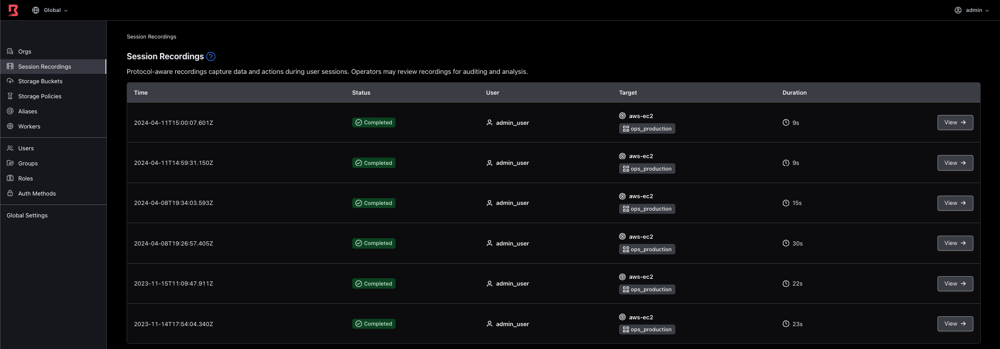

🎥 Enabling Session Recording
===============

Boundary provides auditing capabilities via SSH session recording. When you enable session recording on a target, any user SSH session that connects to the target is automatically recorded. An administrator can later view the recordings to investigate security issues, review system activity, or perform regular assessments of security policies and procedures.

The quickest way to enable session recording is to open up the `hcpb-storage-bucket.tf` in the Editor tab and uncomment out all of the code in the file. This will create the Boundary Storage bucket that makes reference to the AWS S3 bucket. which is then used to hold the Boundary Session Recording (BSR) data. Intially, the worker assigned to the target that has session recording enabled, will store the session recording data locally. Once that session is torn down, the worker will then send the BSR data to the AWS S3 bucket. Currently AWS S3 and MinIO storage are the supported platforms to hold the BSR data. MinIO is S3 compatible so can be run in Public Clouds other than AWS and also for on-prem deployments.

Next, open up the `boundary-vm-target-config.tf` file and uncomment the two lines as shown below:

```
resource "boundary_target" "aws" {
  type                     = "ssh"
  name                     = "aws-ec2"
  description              = "AWS EC2 Target"
  egress_worker_filter     = " \"self-managed-aws-worker\" in \"/tags/type\" "
  scope_id                 = boundary_scope.project.id
  session_connection_limit = -1
  default_port             = 22
  host_source_ids = [
    boundary_host_set_plugin.aws_dev.id,
  ]
  # enable_session_recording                   = true
  # storage_bucket_id                          = boundary_storage_bucket.boundary_storage_bucket.id
  injected_application_credential_source_ids = [boundary_credential_library_vault_ssh_certificate.vault_ssh_cert.id]
}
```
Once this has been completed we need to run another `terraform apply`. Change directory into the `hcpb-secure-access-instruqt` folder and issue a `terraform apply`. After this has been successful, session recording will be enabled for our EC2 target that has been configured with application credential injection. What is also worth noting is that we can apply policies to the recordings. If we look in that `boundary-vm-target-config.tf`, the two resources at the bottom (`boundary_policy_storage` and `boundary_scope_policy_attachment`) allows us to assign policies for our saved session recordings. We can retain files for a set period of time and also tell Boundary to delete files after a configurable number of days.

Enabling this target for session recording could be done via the Admin UI or the CLI if you'd prefer to get more familiar with the UI/CLI.


💻 Connect to the Target
===============

Like we did in the last step, we need to connect to the EC2 target again, if you didn't end the previous session. Once you have gained access, start issuing some commands! When you've finished, close the session and navigate to the Session Recordings section in the Admin UI, as shown in the screenshot below:



Please note that you need to be in the Global scope and not the Org scope, to see the Session Recording data.

You will be able to see the recording that you have just created as a result of running the commnands on the EC2 device. When you click on this recording you will be presented with a video window. If you click play then you can watch back the session that you were just on. This is a crucial feature to provide that important accountability and traceability into what has happend to your resources within your estate, when it happend and by whom.

Currently we are limited to SSH for session recording, but a roadmap item will be RDP session recording.