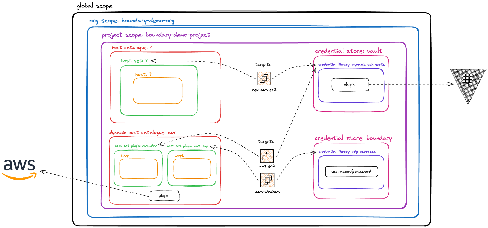

It's all over to you now.
===============

Hopefully so far you have had a chance to navigate around Boundary via the UI, CLI and Desktop Client to understand the architecture and logical constructs. At this point it's time for you to do some work 🙂

In your code editor, you will see a file called `new-aws-ec2.tf`. What is contained within this file is a basic EC2 instance that gets deployed into your existing environment. We use some `cloudinit` configuration, which trusts Vault as the CA and adds the Public Key onto the EC2 instance so you can utilise application credential injection to securely access it.

When you uncomment the code and run a `terraform apply` it will spin up this Amazon Linux EC2 instance. Now you just have to configure Boundary to enable secure access to the target....

Logical Architecture....recap.
=========

I think it's useful at this point to see logically how we have our Boundary deployment (for brevity this diagram doesn't include the RDS database)

As you can see we have the Dynamic Host Catalogue for the `aws-ec2` and `aws-windows` VMs which are automatically pulled into Boundary to allow end-users to connect to them. We can see that both of these targets utilise different credential stores; `aws-e2` uses the integration with Vault to provide those dynamic, ephemeral, just-in-time credentials, and `aws-windows` uses the native credential store in Boundary to access to some static username and password credentials.

You can see that above the `dynamic host catalogue: aws` the host catalogue, host set, host and target all have a `?`. This is what you will now be creating to facilitate connectivity to the `new-aws-ec2` resource you have just created.

In terms of how you would like to create these logical components, it's down to you. We have the CLI or the UI as viable options. Personally the UI provides a little more clarity as it's visual and you can hopefully understand a litter easier what is going on. If you have time and you're feeling adventurous, you can always create everything in the UI first and then try it on the CLI, which will give you some more familiarity with the Boundary command line.

Tips
=========

It is worth starting out by creating the host catalogue and then creating all the other constructs afterwards....(I'd also leave creating the target until the end)

Next steps 
===========

After you have successfully gained access to the target with your new configuration, give yourself a big pat on the back! Well done 💪

You have reached the end of the track, but there is more you can do and explore with Boundary if you're feeling adventurous!

For a list of additional tutorials you could try using your Boundary deployment, head over to the  and enjoy pushing the 'Boundary-s' of your Boundary knowledge 😎